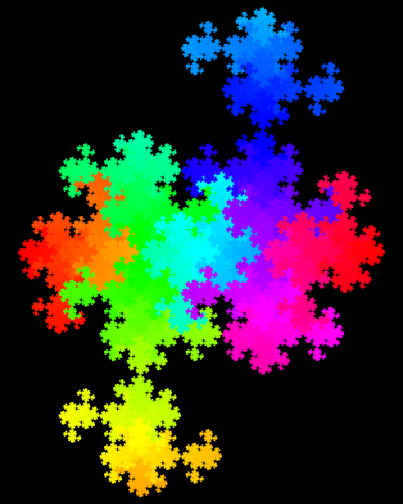
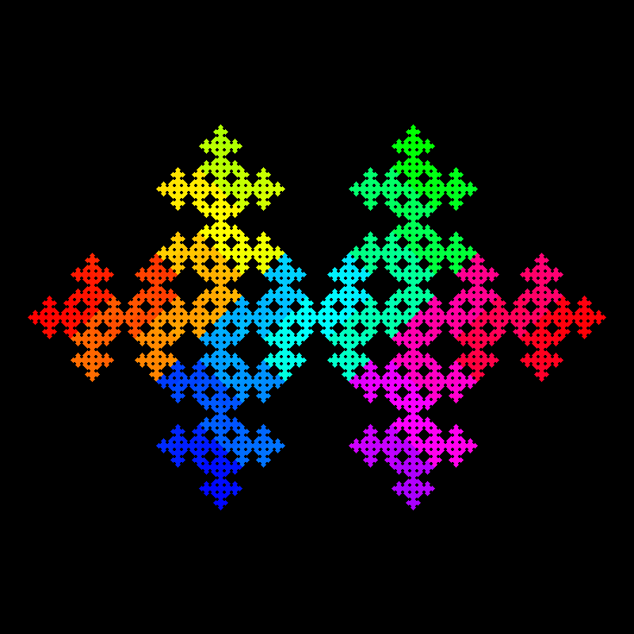
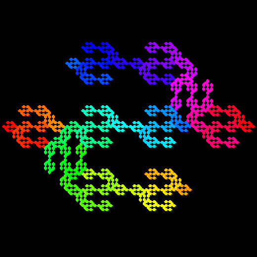
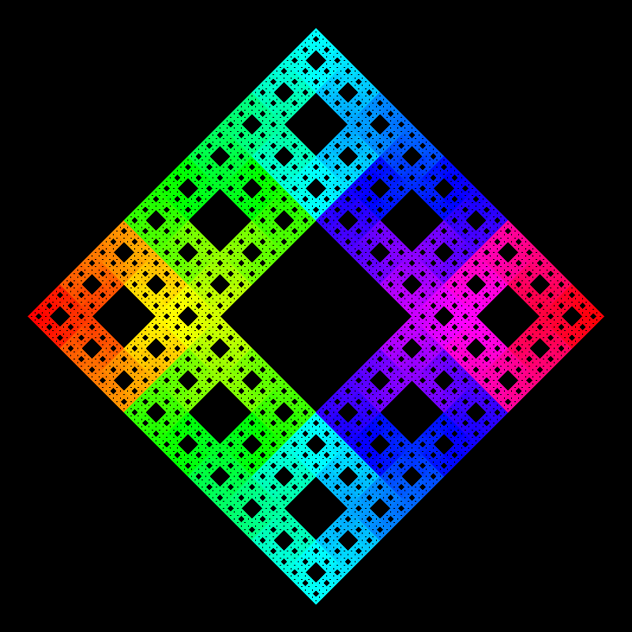

# FractalGen

Basic Fractal Generator.

## Installation

Doesn't require installing anything. Just clone this repo and cd into it.

## Running

Run `./main.py`. To create your own fractals, create a new python file. It will just hold a list of
lists. Each of those will have a list of three tuples. The first is the first point on the line, and
the second is the second point on the line. The third is the new range of colors.

Once this is done, edit main.py to import the new module you created (`import ### as mod`). Then run
`./main`.

## License

Licensed under the MIT license.

## Examples

Here are some more examples:

